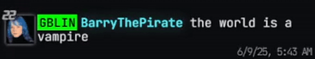

<h1 align="center">Fishtank Live Extended</h1>
An open source project aimed at extending functionality on fishtank.live

Currently available on [Chrome](https://chromewebstore.google.com/detail/dgalkmpecjmnichfppbbpgdekgfbiige?utm_source=item-share-cb) and [Firefox](https://addons.mozilla.org/en-GB/firefox/addon/fishtank-live-extended/).

<h1 align="center">Contribute</h1>

Become a code contributor and your username will show up with a unique effect on the site for anyone using this extension.

<h1 align="center">Features</h1>

## Customisable Settings
Many settings are off by default, especially if experimental.
 - Click profile picture to open the dropdown
 - Click "FLT Extended" to open the settings

## Anti-Spam
Toggle what you want to be hidden in the chat. This feature only hides messages. (It does not add or remove messages from the chat box, so the max chat length still applies)

## Chat Filtering
 - The chat dropdown has a new section if streams are currently happening
 - Clicking on one of the stream names will hide messages in chat that are not from people watching that stream (It does not add or remove messages from the chat box, so the max chat length still applies)
 - EXPERIMENTAL - option in settings to automatically apply the stream room filter when as you change streams (This is experimental due to not being able to properly test when no streams are running on the site)

## Crafting
 - The 'Crafting' section on the FTL Extended Settings screen has a search box for seeing recipes
 - Automatically displays known recipes when crafting with an item

## Logging
 - Logs the system messages that appear at the bottom of the screen when an admin manually sends a message or when the system automatically displays one along with many settings to choose what system message get logged
 - Logs chat message from staff members that have the staff message styling and the staff picture as their profile picture
 - Logs each ping you recieve
 - Logs TTS sent by other users

## Clickable Zones
Untested and experimental.
 - When an area exists on a video stream that you can click to add an item to your inventory, it pushes a system message to notify you
 - Automatially fix broken clickable zones
